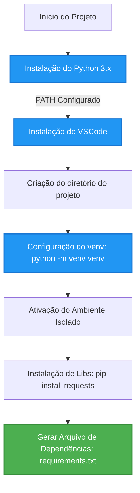

<div align="center">
  
  <h1>🛡️ Coding for Security - 1SM 2026</h1>
  <p>Repositório oficial da disciplina de <b>Coding for Security</b>, focado em desenvolvimento seguro com Python.</p>

  <p>
    
    
    
    
    
  </p>
</div>

---

## 📖 Sobre o Projeto

Este projeto documenta e organiza as aulas, práticas e guias de **segurança da informação aplicando programação**. O conteúdo principal baseia-se nos materiais das duas primeiras aulas disponibilizados neste repositório.

### 🎯 Objetivos
- Aprender conceitos de segurança desde a base e aplicá-los no código.
- Configurar ambientes de desenvolvimento isolados e seguros (Virtual Environments).
- Automação e requisições HTTP de forma segura voltadas para CyberSecurity.

## 🛠️ Tecnologias e Ferramentas

O ambiente de desenvolvimento é todo pautado nas seguintes tecnologias:

* **[Python](https://www.python.org/)** - Linguagem principal, potente e versátil para scripts de segurança.
* **[Visual Studio Code](https://code.visualstudio.com/)** - IDE recomendada para as práticas com foco em produtividade.
* **[Requests](https://pypi.org/project/requests/)** - Biblioteca padrão-ouro no ecossistema Python para requisições HTTP seguras.
* **Ambientes Virtuais (`venv`)** - Para isolar projetos e impedir conflitos de dependências no nível do sistema, uma preocupação vital de segurança.

## 🏗️ Arquitetura e Fluxo de Configuração

Abaixo, um diagrama demonstrando a jornada correta para a configuração do nosso **Ambiente de Desenvolvimento Seguro**, adaptado para a disciplina:



## 📚 Aulas e Materiais Disponíveis

### 📝 Semana 1 e 2
Nestas primeiras semanas, construímos os alicerces. Trabalhamos na configuração do ambiente, instalando ferramentas essenciais e gerando o primeiro ambiente virtual com uma organização profissional.

Consulte o passo a passo completo no nosso guia oficial: [Guia Prático da Semana 2](./aulas/Semana1/atividade%20Pratica%20aula2).

* 📊 **Aula 1.pptx** - Introdução à área, conceitos e visão geral do Coding for Security.
* 📊 **Aula 2.pptx** - Estruturação de código, configuração e boas práticas Python.
* 📝 **atividade Pratica aula2** - O roteiro prático e passo a passo de Instalação e Configuração segura.

*(Obs: Os materiais originais constam como apresentações `.pptx` no repositório, servindo de base para este guia.)*

## 🚀 Como Começar (Quick Start)

Para iniciar os estudos acompanhando as boas práticas de isolamento discutidas na Aula 2, siga o pipeline local:

1️⃣ **Clone o repositório:**
```sh
git clone <url-do-repositorio>
cd CODING_FOR_RECURITY_1SM_2026
```

2️⃣ **Crie sua pasta de estudos e inicie o ambiente virtual (venv):**
```sh
mkdir meu_projeto_seguro
cd meu_projeto_seguro

# No Windows
python -m venv venv
.\venv\Scripts\activate

# No macOS ou Linux
python3 -m venv venv
source venv/bin/activate
```

3️⃣ **Instale a biblioteca `requests` para automações HTTP:**
```sh
pip install requests
```

4️⃣ **Trave suas dependências de maneira segura:**
```sh
pip freeze > requirements.txt
```

---
<div align="center">
  <p>Feito com 🛡️ e segurança para as aulas de <b>Coding for Security</b></p>
</div>
